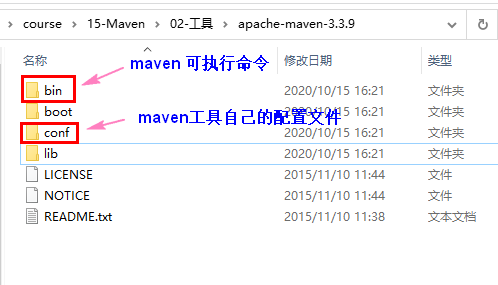

# Maven 自动化的构建工具

#  第一章 Maven简介

## 1.1 软件开发中的阶段

需要分析： 分析项目具体完成的功能，有什么要求， 具体怎么实现。

设计阶段：根据分析的结果， 设计项目的使用什么技术， 解决难点。

开发阶段：编码实现功能。 编译代码。自我测试

测试阶段：专业的测试人员，测整个项目的功能十分符合设计要求。出一个测试报告。

项目的打包，发布阶段： 给用户安装项目


## 1.2 Maven能做什么

1）项目的自动构建，帮助开发人员做项目代码的编译，测试， 打包，安装，部署等工作。

2）管理依赖（管理项目中使用的各种jar包）。

​      依赖：项目中需要使用的其他资源，  常见的是jar 。 比如项目要使用mysql驱动。我们就说项目依赖mysql驱动。


## 1.3 没有使用maven怎么管理依赖

管理jar ，需要从网络中单独下载某个jar 

需要选择正确版本

手工处理jar文件之间的依赖。 a.jar里面要使用b.jar的类。


## 1.4 什么是maven

maven是apache基金会的开源项目，使用java语法开发。 Maven 这个单词的本意是：专家，内行。读音是['meɪv(ə)n]  或  ['mevn]。

maven是项目的自动化构建工具。 管理项目的依赖。


## 1.5 maven中的概念

①POM
②约定的目录结构
③坐标
④依赖管理
⑤仓库管理
⑥生命周期
⑦插件和目标
⑧继承
⑨聚合


## 1.6 maven工具的获取和安装

地址： http://maven.apache.org/  从中下载  .zip文件。 使用的 apache-maven-3.3.9-bin.zip


安装：

1. 确定JAVA_HOME 指定jdk的安装目录， 如果没有JAVA_HOME， 需要在windows的环境变量中创建JAVA_HOME, 它的值是jdk的安装目录

2. 解压缩  apache-maven-3.3.9-bin.zip ，把解压后的文件放到一个目录中。 

   目录的路径不要有中文， 不要有空格。

3. 把maven安装目录中下的bin的路径添加到path中

4. 测试maven的安装。 在命令行执行 mvn     -v

   ```xml
   C:\Users\NING MEI>mvn -v
   Apache Maven 3.3.9 (bb52d8502b132ec0a5a3f4c09453c07478323dc5; 2015-11-11T00:41:47+08:00)
   Maven home: D:\tools\apache-maven-3.3.9\bin\..
   Java version: 1.8.0_101, vendor: Oracle Corporation
   Java home: C:\Program Files\Java\jdk1.8.0_101\jre
   Default locale: zh_CN, platform encoding: GBK
   OS name: "windows 10", version: "10.0", arch: "amd64", family: "dos"
   ```

   

maven解压后的目录结构

	


maven的其他安装方式：

1. 确定JAVA_HOME是否有效

2. 在环境变量中，创建一个叫做M2_HOME (或者MAVEN_HOME) ，它的值是maven的安装目录

   M2_HOME=D:\tools\apache-maven-3.3.9

3. 在path环境变量中，加入 %M2_HOME%\bin    

4. 测试maven的安装，在命令行执行 mvn  -v

   ```xml
   C:\Users\NING MEI>mvn -v
   Apache Maven 3.3.9 (bb52d8502b132ec0a5a3f4c09453c07478323dc5; 2015-11-11T00:41:47+08:00)
   Maven home: D:\tools\apache-maven-3.3.9\bin\..
   Java version: 1.8.0_101, vendor: Oracle Corporation
   Java home: C:\Program Files\Java\jdk1.8.0_101\jre
   Default locale: zh_CN, platform encoding: GBK
   OS name: "windows 10", version: "10.0", arch: "amd64", family: "dos"
   ```

   

# 第二章Maven的核心概念

## 2.1 约定的目录结构

maven项目使用的大多人 遵循的目录结构。 叫做约定的目录结构。

一个maven项目是一个文件夹。 比如项目叫做Hello

```java
Hello 项目文件夹
    \src
    	\main				叫做主程序目录（完成项目功能的代码和配置文件）
             \java          源代码（包和相关的类定义）
    		 \resources	    配置文件
    	\test               放置测试程序代码的（开发人员自己写的测试代码）
    		 \java          测试代码的（junit）
    		 \resources     测试程序需要的配置文件
    \pom.xml                maven的配置文件， 核心文件
```


maven的使用方式：

1）maven可以独立使用： 创建项目，编译代码，测试程序，打包，部署等等

2）maven和idea一起使用：通过idea借助maven，实现编码，测试，打包等等


## 2.2 POM 

POM： Project Object Model 项目对象模型， maven把项目当做模型处理。 操作这个模型就是操作项目。

maven通过pom.xml文件实现 项目的构建和依赖的管理。

```xml

<?xml version="1.0" encoding="UTF-8"?>

<!-- project是根标签， 后面的是约束文件 -->
<project xmlns="http://maven.apache.org/POM/4.0.0" xmlns:xsi="http://www.w3.org/2001/XMLSchema-instance"
  xsi:schemaLocation="http://maven.apache.org/POM/4.0.0 http://maven.apache.org/xsd/maven-4.0.0.xsd">
    
    
  <!-- pom模型的版本， 就是4.0.0 -->  
  <modelVersion>4.0.0</modelVersion>

  <!-- 坐标 -->  
  <groupId>com.bjpowernode</groupId>
  <artifactId>ch01-maven</artifactId>
  <version>1.0-SNAPSHOT</version>
  
  <properties>
     <java.version>1.8</java.version>
     <maven.compiler.source>1.8</maven.compiler.source>
     <maven.compiler.target>1.8</maven.compiler.target>
  </properties>
  
</project>
```


## 2.3 坐标

坐标组成是 groupid, artifiactId, version。  坐标概念来自数学。·

坐标作用：确定资源的，是资源的唯一标识。 在maven中，每个资源都是坐标。 坐标值是唯一的。简称叫gav

```xml
  <groupId>com.bjpowernode</groupId>
  <artifactId>ch01-maven</artifactId>
  <version>1.0-SNAPSHOT</version>
  <packaging>jar</packaging>

groupId: 组织名称，代码。 公司，团体或者单位的标识。 这个值常使用的公司域名的倒写。
         例如：学校的网站 www.bjpowernode.com, groupId: com.bjpowernode

         如果项目规模比较大， 也可以是 域名倒写+大项目名称。
	     例如： www.baidu.com ,  无人车： com.baidu.appollo
artifactId:项目名称， 如果groupId中有项目， 此时当前的值就是子项目名。 项目名称是唯一的。
version：版本， 项目的版本号， 使用的数字。 三位组成。 例如 主版本号.次版本号.小版本号， 例如： 5.2.5。
         注意：版本号中有-SNAPSHOT， 表示快照，不是稳定的版本。      
   
packaging 项目打包的类型， 有jar ，war， ear， pom等等 默认是jar
```

项目使用gav：

1.每个maven项目，都需要有一个自己的gav

2.管理依赖，需要使用其他的jar ，也需要使用gav作为标识。


搜索坐标的地址： https://mvnrepository.com/


## 2.4 依赖 dependency

依赖：项目中要使用的其他资源（jar）。  

需要使用maven表示依赖，管理依赖。 通过使用dependency和gav一起完成依赖的使用

需要在pom.xml文件中，使用dependencies 和dependency， 还有gav 完成依赖的说明。

格式：

```xml

<dependencies>
  
    <!-- 日志 -->
    <dependency>
        <groupId>log4j</groupId>
        <artifactId>log4j</artifactId>
        <version>1.2.17</version>
    </dependency>
    
    <!-- mysql驱动 -->
     <dependency>
        <groupId>mysql</groupId>
        <artifactId>mysql-connector-java</artifactId>
        <version>5.1.16</version>
    </dependency>

</dependencies> 

maven使用gav作为标识，从互联网下载依赖的jar。 下载到你的本机上。  由maven管理项目使用的这些jar
```

## 2.5 仓库

仓库是存东西的，maven的仓库存放的是：

1. maven工具自己的jar包。

2. 第三方的其他jar， 比如项目中要使用mysql驱动。

3. 自己写的程序，可以打包为jar 。 存放到仓库。

   

仓库的分类：

1. 本地仓库（本机仓库）： 位于你自己的计算机， 它是磁盘中的某个目录。

   本地仓库：默认路径，是你登录操作系统的账号的目录中/.m2/repository

   ```xml
        C:\Users\NING MEI\.m2\repository
   ```

   

   修改本地仓库的位置：修改maven工具的配置文件（maven的安装路径\conf\setting.xml）

   ​	步骤：

   ​     1）创建一个目录，作为仓库使用。  目录不要有中文和空格。 目录不要太深。

   ​		   例如： D:\openrepository

   ​     2）修改setting.xml文件，指定 D:\openrepository这个目录

   ```xml
       <localRepository>D:/openrepository</localRepository>
   ```

   ​    3) 把我给你提供的 仓库的资源 拷贝到 D:/openrepository

     

   

2. 远程仓库： 需要通过联网访问的

   1）中央仓库： 一个ftp服务器， 存放了所有的资源。 

   2）中央仓库的镜像： 就是中央仓库的拷贝。 在各大主要城市都有镜像。

   3）私服：在局域网中使用的。 私服就是自己的仓库服务器。 在公司内部使用的。


maven使用仓库： maven自动使用仓库， 当项目启动后， 执行了maven的命令， maven首先访问的是本地仓库， 从仓库中获取所需的jar， 如果本地仓库没有 ，需要访问私服或者中央仓库或者镜像。


	

## 2.6 maven的生命周期，插件和命令

maven的生命周期： 项目构建的各个阶段。 包括 清理， 编译， 测试，报告，打包，安装，部署

插件：要完成构建项目的各个阶段，要使用maven的命令， 执行命令的功能是通过插件完成的。插件就是jar，一些类。

命令： 执行maven功能是 由命令发出的。 比如 mvn compile


单元测试（junit）：

junit是一个单元测试的工具， 在java中经常使用。

单元：在java中指的是方法。  一个方法就是一个单元， 方法是测试的最小单位。

作用：使用junit去测试方法是否完成了要求。 开发人员自测。


使用单元测试：

1）加入junit的依赖（一些类和方法）

```xml
<dependency>
    <groupId>junit</groupId>
    <artifactId>junit</artifactId>
    <version>4.12</version>
    <scope>test</scope>
</dependency>

```


2)在src/test/java 目录中创建测试类文件。 写测试代码

   单元测试使用的建议：

​    1.测试类的定义， 名称一般是Test+要测试的类名称

​    2.测试类它的包名和要测试的类包名一样。

​    3.在类中定义方法，要测试代码。

​       方法的定义：public方法， 

​                               没有返回值

​                               方法名称自定义（建议 Test+测试的方法名称）

​                               方法没有参数

   4.在测试类中的方法，可以单独执行。 测试类也可以单独执行

   5.在方法的上面加入@Test


命令：

1） mvn clean: 清理命令， 作用删除以前生成的数据， 删除target目录。

​      插件： maven-clean-plugin   ， 版本是 2.5

2）mvn compile:编译命令，执行的代码编译， 把src/main/java目录中的java代码编译为class文件。

​     同时把class文件拷贝到 target/classes目录。 这个目录classes是存放类文件的根目录（也叫做类路径，classpath）


​    插件： maven-compiler-plugin 版本3.1。  编译代码的插件

​                maven-resources-plugin 版本2.6 。 资源插件， 处理文件的。 作用是把src/main/resources目录中的                

​                                                             文件拷贝target/classes目录中。

3）mvn test-compile: 编译命令， 编译src/test/java目录中的源文件， 把生成的class拷贝到target/test-classes目录。同时把src/test/resources目录中的文件拷贝到 test-clasess目录

​    插件： maven-compiler-plugin 版本3.1。  编译代码的插件

​                maven-resources-plugin 版本2.6 。 资源插件， 处理文件的


4）mvn test:测试命令， 作用执行 test-classes目录的程序， 测试src/main/java目录中的主程序代码是否符合要求。

​     插件： maven-surefire-plugin 版本 2.12.4


5）mvn package:打包，作用是把项目中的资源class文件和配置文件都放到一个压缩文件中， 默认压缩文件是jar类型的。 web应用是war类型， 扩展是jar，war的。

​    插件：maven-jar-plugin 版本 2.4。 执行打包处理。 生成一个jar扩展的文件， 放在target目录下.

​               打包的文件包含的是 src/main目录中的所有的生成的class和配置文件和test无关。


​    生成的是 ch01-maven-1.0-SNAPSHOT.jar

```xml
  <groupId>com.bjpowernode</groupId>
  <artifactId>ch01-maven</artifactId>
  <version>1.0-SNAPSHOT</version>
  <packaging>jar</packaging>
打包的文件名： artifactId-version.packaging
```


6）mvn install : 把生成的打包的文件 ，安装到maven仓库。

​     插件： maven-install-plugin 版本 2.4 。 把生成的jar文件安装到本地仓库。 

​    查看查看中的jar文件：

```xml
  <groupId>com.bjpowernode</groupId>
  <artifactId>ch01-maven</artifactId>
  <version>1.0-SNAPSHOT</version>
  <packaging>jar</packaging>

groupId中的值， 如果有 "." 前和后都是独立的文件夹。 com\bjpowernode
artifactId, 独立的文件夹
version，独立的文件夹
```


   ## 2.7 自定义配置插件

在pom.xml文件中， build标签中。设置插件

  

```xml
<!-- 设置构建项目相关的内容 -->
<build>
  <plugins>
    <!-- 设置插件 -->
	<plugin>
		<groupId>org.apache.maven.plugins</groupId>
		<artifactId>maven-compiler-plugin</artifactId>
		<version>3.8.1</version>
		<configuration>
			<source>1.8</source> <!-- 指定编译代码的jdk版本 -->
			<target>1.8</target> <!-- 运行java程序使用的jdk版本-->
		</configuration>
	</plugin>
  </plugins>
</build> 
```


# 第三章 Maven和idea的集成

## 3.1 idea中集成maven

idea中有一个自带的maven。  我们要让idea使用自己安装的maven。

1) 选择File- Settings 

	

	

设置项： -DarchetypeCatalog=internal


2） File - Other Settings


同上的设置


## 3.2 创建基于maven的普通java项目

	


## 3.3 创建web项目

	

## 3.4 导入module到idea


	


# 4. 第四章 依赖管理

依赖范围：使用scope表示依赖的范围。 

依赖范围表示： 这个依赖（jar和里面类）在项目构建的那个阶段起作用。

依赖范围scope ：

​     compile:默认， 参与构建项目的所有阶段

​     test：测试，在测试阶段使用， 比如执行mvn test会使用junit 。

​    provided: 提供者。 项目在部署到服务器时，不需要提供这个依赖的jar ， 而是由服务器这个依赖的jar包

​					  明显的是servlet 和jsp 依赖


# 5. 第五章 常用设置

1)讲的是properties它里面的配置

```xml
<properties>
<maven.compiler.source>1.8</maven.compiler.source> 源码编译 jdk 版本
<maven.compiler.target>1.8</maven.compiler.target> 运行代码的 jdk 版本
<project.build.sourceEncoding>UTF-8</project.build.sourceEncoding> 项目
构建使用的编码，避免中文乱码
<project.reporting.outputEncoding>UTF-8
</project.reporting.outputEncoding> 生成报告的编码
</properties>
```


2) 全局变量

在properties定义标签，这个标签就是一个变量， 标签的文本就是变量的值。 

使用全局变量表示 多个依赖使用的版本号。


使用步骤：

1.在properties标签中，定义一个标签，指定版本的值

```xml
<properties>
  <project.build.sourceEncoding>UTF-8</project.build.sourceEncoding>
  <maven.compiler.source>1.8</maven.compiler.source>
  <maven.compiler.target>1.8</maven.compiler.target>
  <!--自定义变量-->
  <spring.version>5.2.5.RELEASE</spring.version>
  <junit.version>4.11</junit.version>
</properties>
```


2. 使用全局变量， 语法 ${变量名}

```xml
<dependency>
  <groupId>org.springframework</groupId>
  <artifactId>spring-core</artifactId>
  <version>${spring.version}</version>
</dependency>

<dependency>
  <groupId>org.springframework</groupId>
  <artifactId>spring-web</artifactId>
  <version>${spring.version}</version>
</dependency>
```


3）使用资源插件

处理的配置文件的信息， maven默认处理配置文件

①：maven会把src/main/resources目录中的文件， 拷贝到target/classes目录下

②：maven只处理src/main/java目录中的 .java文件，把这些java文件编译为class，拷贝到 target/classes目录中。 不处理其他文件。


```xml
<build>
  <!--资源插件
      告诉maven把 src/main/java目录中的 指定扩展名的文件 拷贝到 target/classes目录中。
  -->
  <resources>
    <resource>
      <directory>src/main/java</directory><!--所在的目录-->
      <includes>
      <!--包括目录下的.properties,.xml 文件都会扫描到-->
        <include>**/*.properties</include>
        <include>**/*.xml</include>
      </includes>
        <!--  filtering 选项 false 不启用过滤器， *.property 已经起到过
        滤的作用了 -->
      <filtering>false</filtering>
    </resource>
  </resources>
</build>
```

